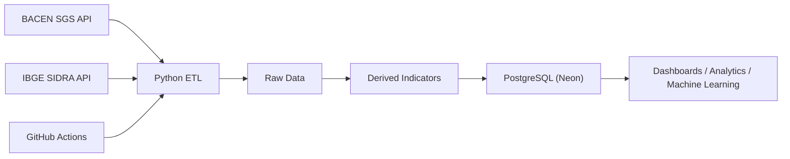
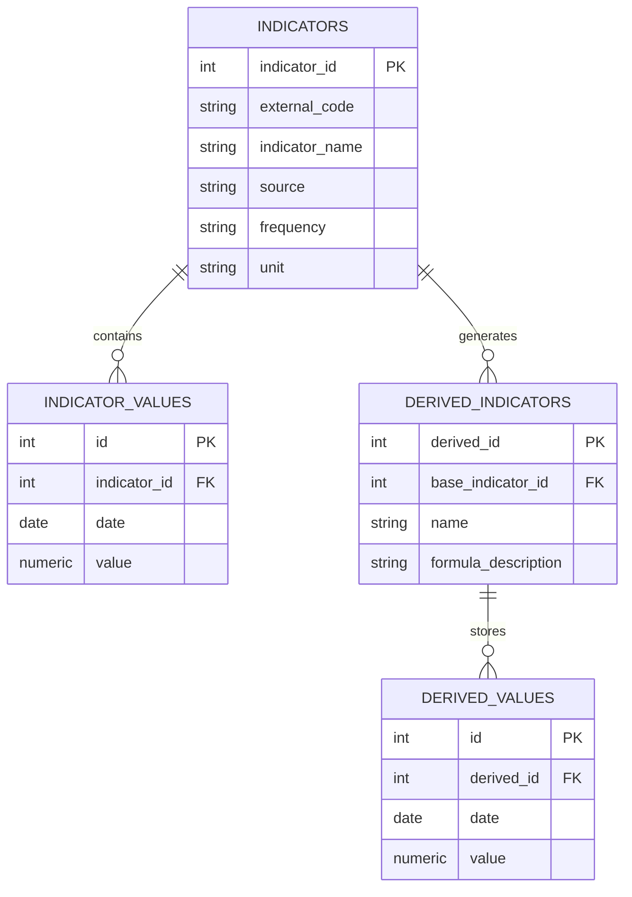

# 🇧🇷 Brazil Economic Data Pipeline

[](https://www.python.org/)
[](https://neon.tech/)
[](https://github.com/features/actions)
[](LICENSE)

This dataset is also available on [Kaggle](https://www.kaggle.com/datasets/fabiokitsuwa/brazil-macroeconomic-indicators)!

An automated ETL pipeline that continuously collects official Brazilian macroeconomic indicators from **BACEN** and **IBGE**, transforms heterogeneous datasets into a standardized format, and stores historical time series in a **PostgreSQL** database hosted on **Neon**.

The project simulates a production-style data engineering workflow by combining automated data ingestion, data transformation, database modeling, cloud deployment, and scheduled execution.

---

# Skills Demonstrated

* Python
* REST API Integration
* ETL Pipeline Development
* Data Cleaning & Transformation
* Time Series Processing
* PostgreSQL
* SQLAlchemy
* Database Modeling
* Incremental Data Loading
* GitHub Actions
* Cloud Database Deployment

---

# Project Highlights

* 11 macroeconomic indicators
* 2 official government APIs
* Automated ETL pipeline
* PostgreSQL cloud database
* Automatic derived indicator generation
* Scheduled execution with GitHub Actions

---

# Project Objectives

This project was designed to simulate a real-world data engineering pipeline.

Its main objectives are to:

* Automatically collect official Brazilian macroeconomic indicators
* Standardize datasets obtained from different public APIs
* Store historical observations in a relational database
* Eliminate manual data collection
* Build a reusable data source for dashboards, analytics, and machine learning projects

---

# Why This Project?

Macroeconomic indicators are published independently by different Brazilian government institutions, each exposing data through distinct APIs, structures, and update frequencies.

Analysts frequently spend significant time downloading spreadsheets, cleaning datasets, and organizing historical series before beginning any analysis.

This project automates that workflow by creating a centralized and continuously updated database that is immediately ready for analytical consumption.

---

# Data Pipeline



---

# Technology Stack

| Category        | Technologies      |
| --------------- | ----------------- |
| Programming     | Python 3.11+      |
| Data Processing | Pandas            |
| API Access      | Requests          |
| Database        | PostgreSQL (Neon) |
| ORM             | SQLAlchemy        |
| Database Driver | psycopg2          |
| Configuration   | python-dotenv     |
| Automation      | GitHub Actions    |
| Version Control | Git & GitHub      |

---

# Data Sources

The pipeline integrates official public datasets from two primary sources.

| Source             | Description                                                                |
| ------------------ | -------------------------------------------------------------------------- |
| **BACEN SGS API**  | Interest rates, inflation, exchange rates and economic activity indicators |
| **IBGE SIDRA API** | GDP, industrial production, retail sales and labor market statistics       |

## Current Indicators

### BACEN

| Indicator                      | Code  | Frequency | Transformation  |
| ------------------------------ | ----- | --------- | --------------- |
| SELIC Target Rate              | 432   | Daily     | Daily Variation |
| IPCA Inflation                 | 433   | Monthly   | Year-over-Year  |
| IPCA (12-Month Accumulated)    | 13522 | Monthly   | None            |
| INPC Inflation                 | 188   | Monthly   | Year-over-Year  |
| IGP-M Inflation                | 189   | Monthly   | Year-over-Year  |
| IBC-Br Economic Activity Index | 24364 | Monthly   | None            |
| USD/BRL Exchange Rate          | 1     | Daily     | Daily Variation |

### IBGE

| Indicator                         | Frequency |
| --------------------------------- | --------- |
| Quarterly GDP (Volume Index)      | Quarterly |
| Industrial Production (PIM-PF)    | Monthly   |
| Retail Sales Volume               | Monthly   |
| Unemployment Rate (PNAD Contínua) | Monthly   |

---

# ETL Process

## Extract

The pipeline retrieves macroeconomic indicators directly from official public APIs.

Current sources include:

* BACEN SGS API
* IBGE SIDRA API

## Transform

Before loading the data into PostgreSQL, several preprocessing steps are automatically applied:

* Date standardization
* Numeric conversion
* Missing value handling
* Duplicate removal
* Metadata enrichment
* Frequency normalization
* Daily variation calculation
* Year-over-Year variation calculation

Different indicators receive different transformation rules according to their statistical characteristics.

## Load

The loading process is divided into two layers.

### Raw Layer

Stores the original observations exactly as published by BACEN and IBGE.

**Tables**

* indicators
* indicator_values

### Derived Layer

Stores analytical indicators generated during the transformation stage.

Examples include:

* Daily percentage variation
* Year-over-Year inflation

**Tables**

* derived_indicators
* derived_values

---

# Database Model

The database follows a normalized schema that separates **raw indicators** collected from official APIs from **derived indicators** generated during the transformation stage.

This design preserves the original datasets while allowing additional calculated metrics to be generated independently.



## Database Design

| Table                  | Purpose                                                |
| ---------------------- | ------------------------------------------------------ |
| **indicators**         | Stores metadata describing every collected indicator.  |
| **indicator_values**   | Stores historical observations for raw indicators.     |
| **derived_indicators** | Stores metadata for calculated indicators.             |
| **derived_values**     | Stores historical observations for derived indicators. |

This separation preserves the original data while allowing reusable analytical metrics to coexist independently.

---

# Derived Indicators

Additional analytical indicators are automatically generated during the transformation stage.

Current derived metrics include:

| Base Indicator        | Derived Metric           |
| --------------------- | ------------------------ |
| SELIC                 | Daily Variation          |
| USD/BRL Exchange Rate | Daily Variation          |
| IPCA                  | Year-over-Year Inflation |
| INPC                  | Year-over-Year Inflation |
| IGP-M                 | Year-over-Year Inflation |

Derived indicators are stored separately from the original time series, ensuring data lineage and preserving raw observations.

---

# Automation

The entire pipeline is orchestrated using **GitHub Actions**.

Features include:

* Scheduled execution
* Manual execution
* Secure credentials managed through GitHub Secrets
* Fully automated database updates

This ensures that the database remains synchronized with the latest official releases without requiring manual intervention.

---

# Local Execution

Clone the repository.

```bash
git clone https://github.com/YukioK38/brazil-economic-data-pipeline.git
```

Create a virtual environment.

```bash
python -m venv .venv
```

Install dependencies.

```bash
pip install -r requirements.txt
```

Configure the database credentials in the `.env` file.

Run the pipeline.

```bash
python main.py
```

---

# License

This project is licensed under the MIT License.

---

# Contact

**Fabio Kitsuwa**

* GitHub: https://github.com/YukioK38
* LinkedIn: https://linkedin.com/in/fabio-kitsuwa
